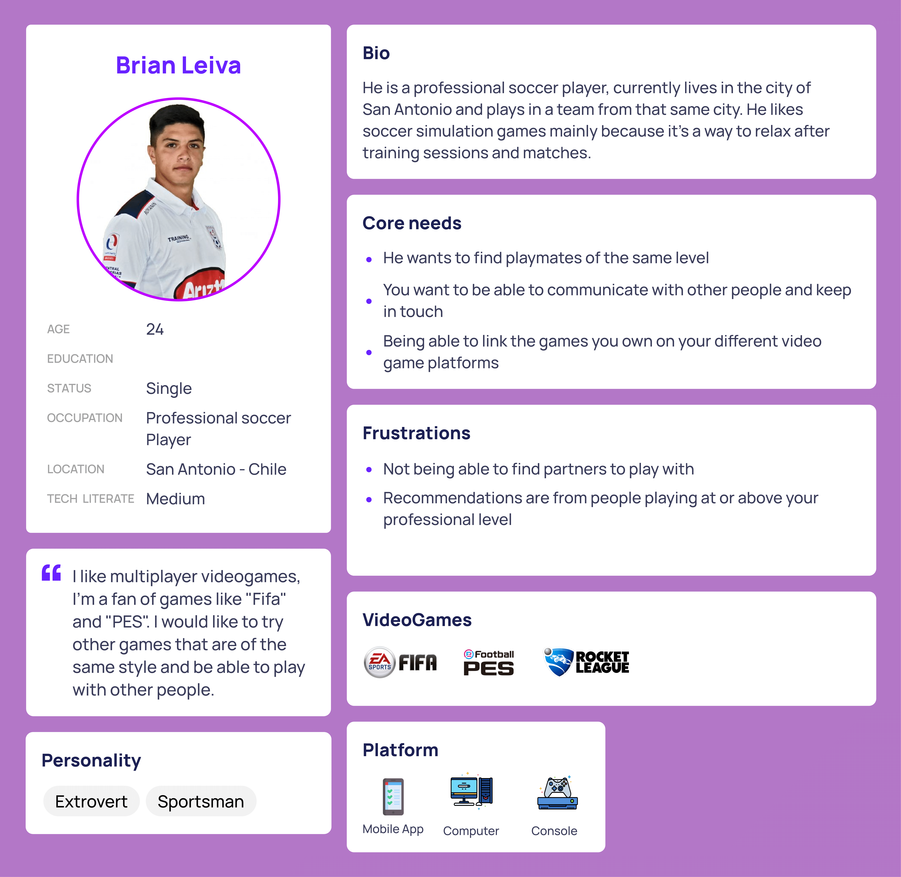
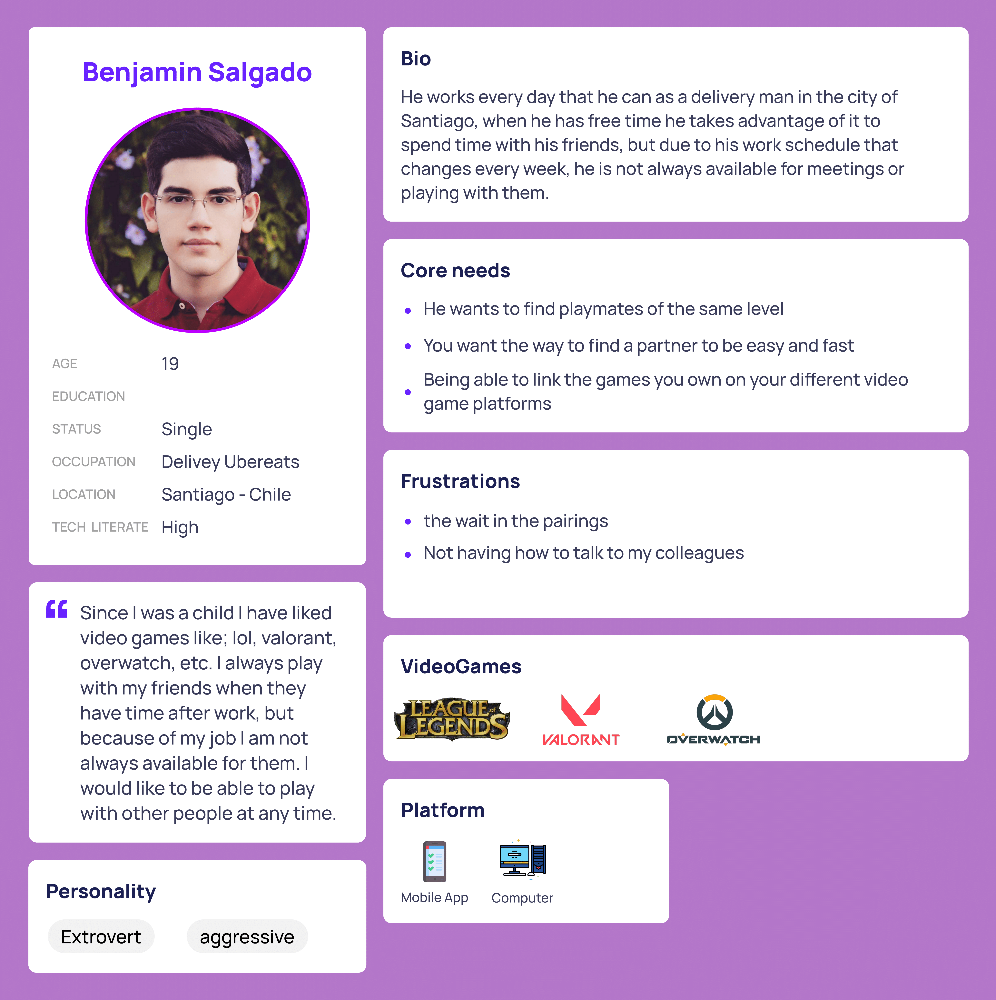
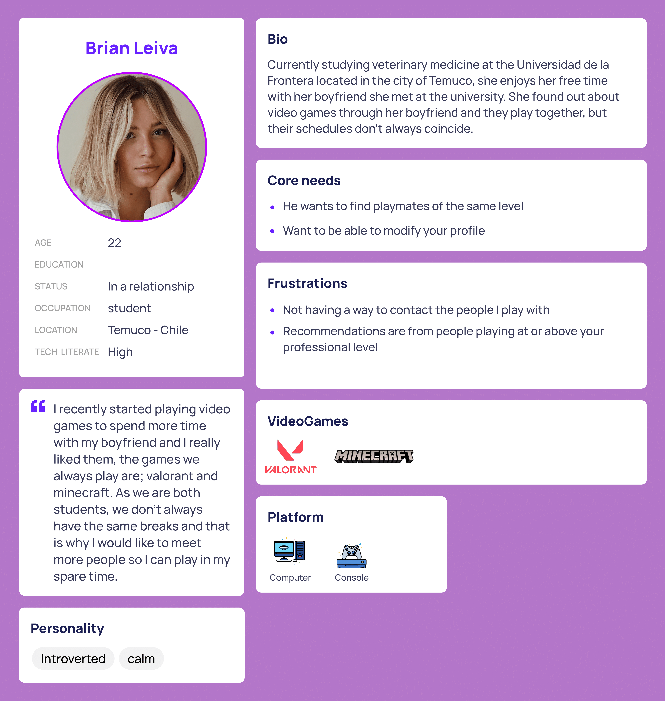

# TimGame

User Experience Proyect.

## Team Role Identification:
To optimize and ease the project development were assigned roles to each member of the team which they will be divided and assigned the most adequate tasks the the respective roles.
The team is a group of 3 people who are going to work under one of three roles, being this  project manager, analyst and designer:

## Project manager:
Member: **Rodrigo Brevis**

Team member in charge of the project management and leadership. Responsible for planning, leading and taking the necessary decisions  so that the team can adequately do their tasks. Also is responsible for the respective presentations for each advance of the project.

## Analysts:
Members: **Andy Sandoval**

Team members in charge of identifying the product needs and requirements. They are responsible for the process related to acquiring and interpreting the information that is valuable for the project development like defining personas, functionality definition and proposals formalization.

## Designer:
Member: **Nicolas Rivas**

Team member in charge of the main content that is going to be evaluated in the project. Responsible for the design process, planification, and interface creation. This task can be the creation of wireframes, mockups and the result of these as a finished interface.

# NOTE: Relevant content in the outputs folder

